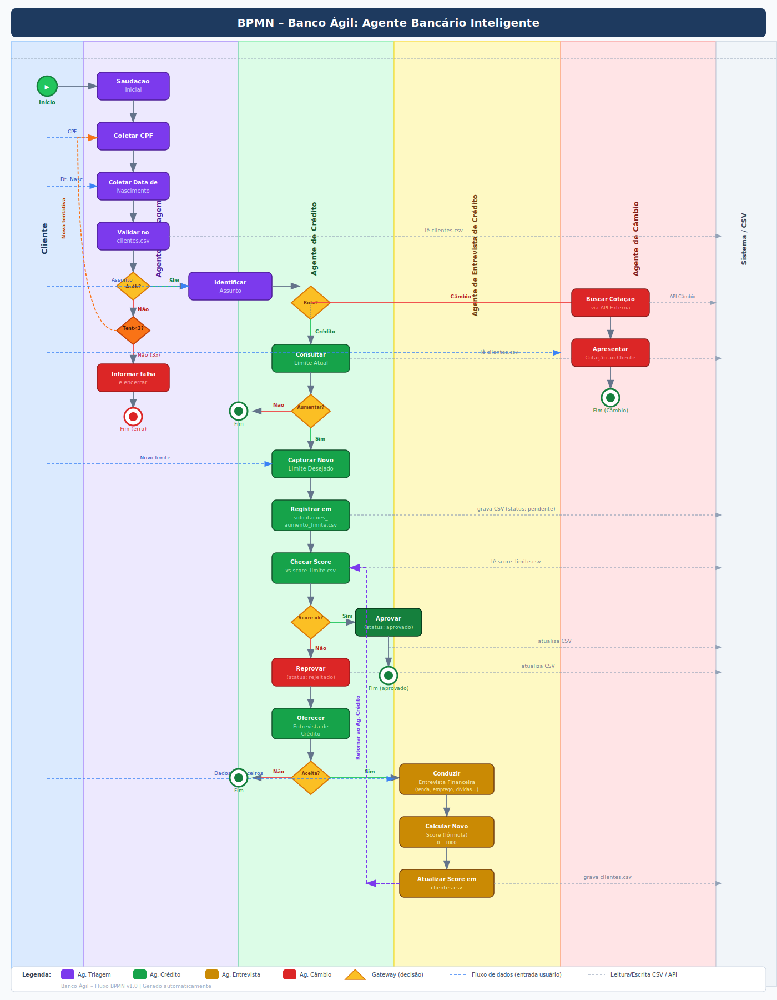

# 🏦 Agente Bancário Inteligente - Banco Ágil

Este projeto é um sistema modular de atendimento bancário automatizado que utiliza **Orquestração de Múltiplos Agentes** (Multi-Agent System) para simular o fluxo de operação de um banco digital moderno. O sistema gerencia desde a autenticação segura do cliente até operações complexas de crédito e câmbio.

---

## 📖 Visão Geral

O objetivo do projeto é fornecer uma interface de conversação inteligente onde diferentes especialistas (agentes) colaboram para resolver a necessidade do cliente. O sistema é capaz de persistir dados, calcular scores de crédito dinamicamente e consultar APIs externas para cotação de moedas, tudo isso mantendo o contexto da conversa.

## 📁 Estrutura do Projeto

A organização do projeto segue uma lógica modular para facilitar a manutenção e a expansão de novos agentes:

```text
agente-bancario-inteligente/
├── agentes/                # Núcleo de Inteligência (Agentes)
│   ├── __init__.py         # Exportação e orquestração dos agentes
│   ├── agente_triagem.py   # Autenticação e roteamento inicial
│   ├── agente_credito.py   # Lógica de limite e score de crédito
│   ├── agente_entrevista.py# Coleta de dados e análise de perfil
│   └── agente_cambio.py    # Integração com API de moedas
├── data/                   # Persistência de Dados (Simulação de DB)
│   ├── clientes.csv        # Base principal de correntistas
│   ├── score_limite.csv    # Regras de teto de crédito por score
│   └── solicitacoes_...csv # Log de pedidos de aumento de limite
├── app.py                  # Orquestrador Central e Interface UI (Streamlit)
├── .env                    # Chaves de API (não versionado)
├── requirements.txt        # Dependências do sistema
└── README.md               # Documentação do projeto
```

---

## 📐 Arquitetura do Sistema

A arquitetura segue o padrão de **Agentes Especialistas** orquestrados por uma camada central no `app.py`.

### Os 4 Agentes
1.  **🤖 Agente de Triagem:** O "porteiro" do sistema. Valida CPF e data de nascimento contra o `clientes.csv`. Possui lógica de segurança para bloquear acessos após 3 tentativas inválidas.
2.  **💳 Agente de Crédito:** O tomador de decisão. Analisa pedidos de aumento de limite baseando-se no score atual e nas regras de teto definidas em `score_limite.csv`.
3.  **📝 Agente de Entrevista:** O analista de perfil. Conduz uma entrevista sequencial para entender a saúde financeira do cliente e recalcular seu score, permitindo novas chances de crédito.
4.  **💱 Agente de Câmbio:** O consultor de mercado. Acessa a API da *AwesomeAPI* para fornecer cotações em tempo real de USD.

### Fluxo de Dados
- **Persistência:** Os dados são manipulados via **Pandas** em arquivos CSV, simulando tabelas de banco de dados (`clientes.csv`, `score_limite.csv`, `solicitacoes_aumento_limite.csv`).
- **Memória:** O histórico de conversa é gerenciado pelo **LangChain**, garantindo que os agentes "lembrem" do que foi dito anteriormente.

### 🗺️ Documentação Visual (BPMN)
O projeto foi desenhado seguindo as exigências do desafio oficial, utilizando a metodologia BPMN para mapear cada gateway de decisão e troca de mensagens.


---

## ✨ Funcionalidades Implementadas

- ✅ **Autenticação Rígida:** Verificação de múltiplos fatores (CPF/Data) com controle de tentativas.
- ✅ **Aumento de Limite Instantâneo:** Aprovação e gravação imediata na base de dados se os requisitos forem atendidos.
- ✅ **Recálculo de Score Dinâmico:** Algoritmo interno que processa dados da entrevista e atualiza o perfil do cliente.
- ✅ **Consulta de Câmbio Real:** Integração com API externa para dados financeiros atualizados.
- ✅ **Resiliência a Erros:** Tratamento de exceções para falhas de API, arquivos corrompidos e entradas inválidas.

---

## 🧠 Escolhas Técnicas e Justificativas

### O Desafio dos Modelos (LLMs)
Durante o desenvolvimento, foram realizados testes extensivos com diferentes modelos via OpenRouter:
- **Gemini 2.0 Flash:** Apresentou dificuldades em seguir instruções sistêmicas complexas e alucinações frequentes em gateaways de roteamento.
- **Qwen3 VL & GPT-OSS:** Modelos de "Thinking" que, apesar de potentes, mostraram-se lentos demais para a experiência de chat e muitas vezes divagavam em tarefas simples de extração de dados.

### A Solução: Groq + Llama 3.3 70B
A escolha final foi o **Llama 3.3 70B rodando no Groq**. 
- **Justificativa:** A baixíssima latência do Groq combinada com a capacidade de raciocínio do Llama 3.3 permitiu que as trocas entre agentes fossem quase instantâneas. O modelo se mostrou superior em seguir as "regras de ouro" do sistema (como não pedir documentos ou não sair do contexto de crédito).

### Frameworks
- **LangChain:** Utilizado para a orquestração e troca silenciosa de agentes (handover).
- **Streamlit:** Escolhido pela facilidade em criar uma interface de chat profissional e reativa para o usuário final.

---

## 🚀 Tutorial de Execução

### 1. Preparação
```bash
python -m venv venv
source venv/bin/activate  # Linux/Mac
# ou
venv\Scripts\activate     # Windows

pip install -r requirements.txt
```

### 2. Configuração
Crie um arquivo `.env` e adicione sua chave:
```env
GROQ_API_KEY=sua_chave_groq_aqui
```

### 3. Execução
```bash
streamlit run app.py
```

---

## 🛠️ Desafios Enfrentados e Soluções

1.  **Alucinação de Rota:** O modelo às vezes tentava ir para o Câmbio ao falarmos de "aumentar score". 
    - *Solução:* Implementei **Trava de Palavras-Chave** no código Python do `AgenteCredito`, garantindo que intenções específicas de score sempre forcem o roteamento para Entrevista.
2.  **Persistência de Dados:** Garantir que o CSV fosse atualizado sem perder o cabeçalho ou duplicar linhas.
    - *Solução:* Refatoração dos métodos de escrita do Pandas para usar normalização de CPF (`zfill`) antes de qualquer busca ou edição.
3.  **Instrução de Sistema:** O modelo tentava criar processos burocráticos (pedir RG/Renda).
    - *Solução:* Refinamento do `SystemMessage` com **Regras Críticas** em caixa alta, instruindo o modelo sobre o que ele NÃO deve fazer.
